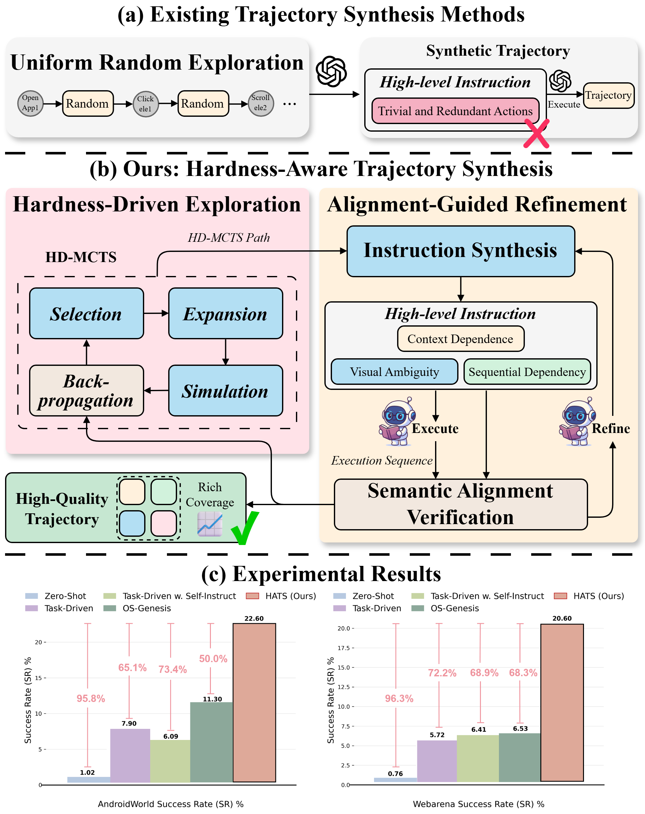
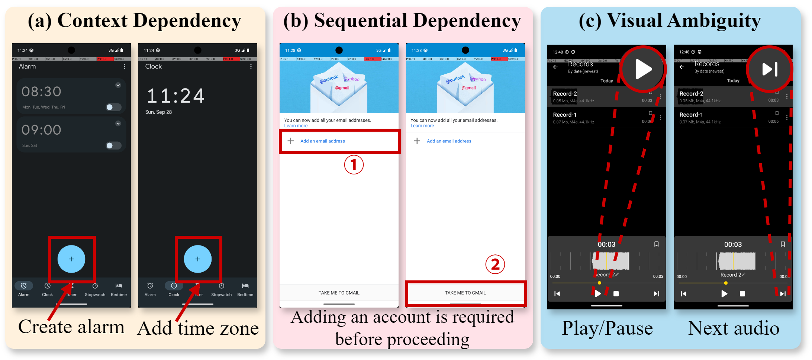
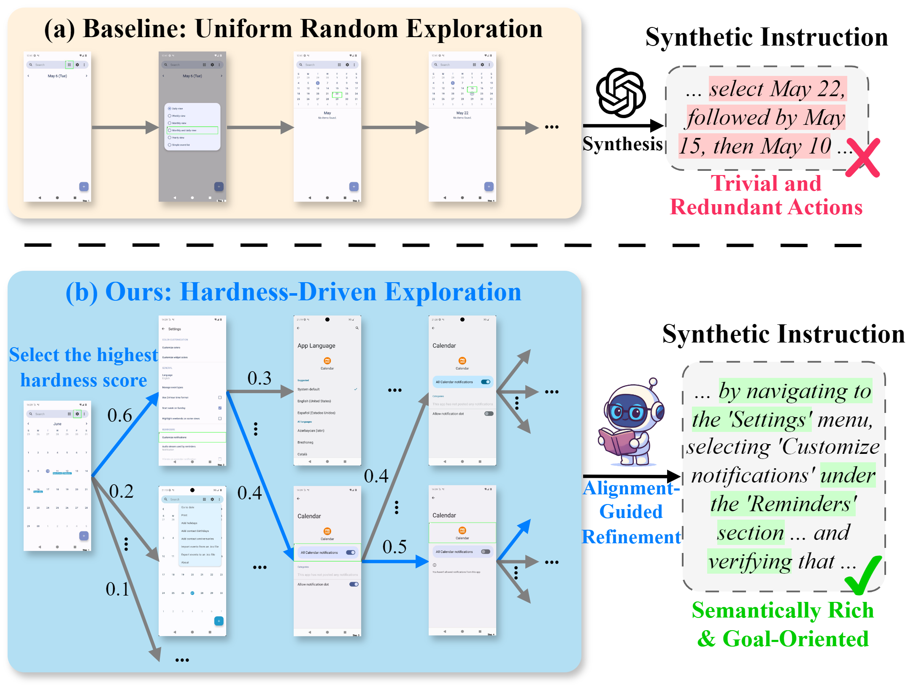
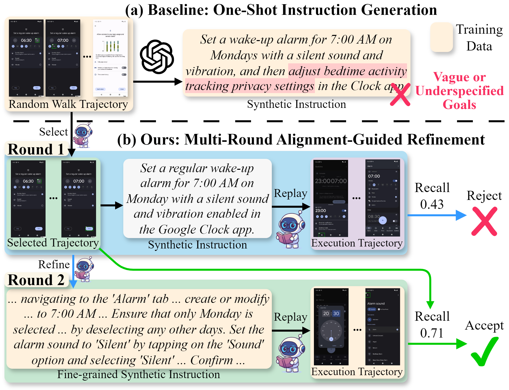
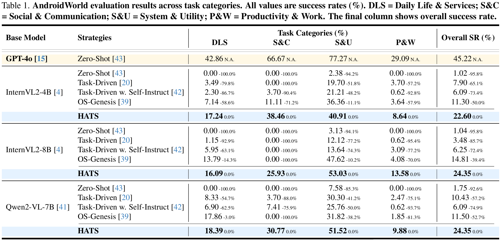
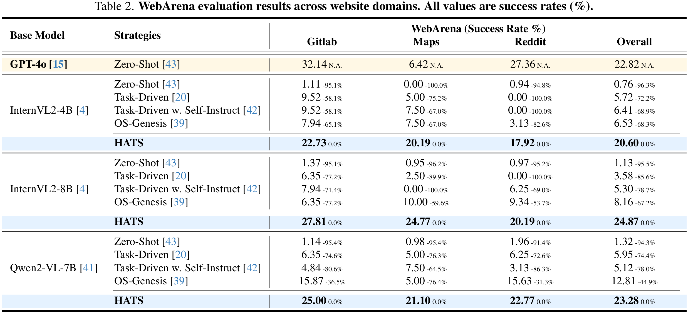

<div align="center">

<h2>
  
  <b><b>HATS: Hardness-Aware Trajectory Synthesis for GUI Agents</b></b>
</h2>

<p>
<a href="https://scholar.google.com/citations?user=9Vc--XsAAAAJ">Rui Shao</a><sup>1,3,&dagger;</sup>,
<a>Ruize Gao</a><sup>2,&dagger;</sup>,
<a href="https://xieincz.github.io">Bin Xie</a><sup>1</sup>,
<a>Yixing Li</a><sup>1</sup>,
<a href="https://jnhujnhu.github.io/">Kaiwen Zhou</a><sup>4</sup>,
<a>Shuai Wang</a><sup>4</sup>,
<a>Weili Guan</a><sup>1,3</sup>,
<a href="https://scholar.google.com/citations?user=Mpg0w3cAAAAJ">Gongwei Chen</a><sup>1,*</sup>
</p>

<p>
<sup>1</sup> Harbin Institute of Technology, Shenzhen&nbsp;&nbsp;&nbsp;
<sup>2</sup> National University of Singapore, CNRS@CREATE<br>
<sup>3</sup> Shenzhen Loop Area Institute&nbsp;&nbsp;&nbsp;
<sup>4</sup> Huawei Noah’s Ark Lab
</p>

<p><sup>&dagger;</sup> Equal contribution&nbsp;&nbsp;&nbsp;<sup>*</sup> Corresponding author</p>

[](https://arxiv.org/abs/xxx)
[](https://huggingface.co/datasets/wvvvvvw/HATS-Dataset)
[](https://huggingface.co/wvvvvvw/HATS-Model)
[](https://xieincz.github.io/HATS.github.io)

</div>


## 💡 Brief View

<p align="center">

</p>


Overview of trajectory synthesis paradigms. Compared with (a) existing methods, (b) **HATS** integrates hardness-driven exploration and alignment-guided refinement in a closed loop, producing high-quality trajectories with rich semantic coverage and strong instruction--execution alignment. (c) Experiments show **HATS** outperforms OS-Genesis by **100%↑** on AndroidWorld (**22.60 vs. 11.30**) and **215%↑** on WebArena (**20.60 vs. 6.53**).


---

## 🔍 The Problem: Semantic-Ambiguous Actions

<p align="center">

</p>


Current GUI trajectory synthesis pipelines struggle with **semantic-ambiguous actions**—interactions whose functional meaning depends on contextual, sequential, or visual cues. These actions are:

- **Under-represented**: Over 70% of collected traces collapse into trivial actions like "open menu" or "tap back"
- **Poorly processed**: When captured, they often lead to instruction-execution misalignment, introducing noisy supervision

Examples of semantic-ambiguous actions include:
- **(a)** Identical icons triggering different functions depending on context
- **(b)** Operations requiring prerequisite steps to succeed
- **(c)** Visually similar elements leading to distinct outcomes

---

## 🏗️ HATS Framework

<p align="center">

</p>


HATS consists of two cooperative modules unified through **Hardness-Driven Monte Carlo Tree Search (HD-MCTS)**:

### 1️⃣ Hardness-Driven Exploration Module

<p align="center">

</p>


**Problem with uniform exploration:** Random walks oversample trivial actions and miss semantically challenging interactions.

**Our solution:** Replace random exploration with a hardness-aware policy that:
- Uses UCB-based selection to balance exploration and exploitation
- Prioritizes under-represented, semantically complex UI states
- Concentrates search effort on high-value, ambiguous actions

### 2️⃣ Alignment-Guided Refinement Module

<p align="center">

</p>


**Problem with one-shot synthesis:** Direct instruction generation produces vague descriptions that fail to replay consistently.

**Our solution:** Multi-round refinement process that:
- **Synthesizes** initial instruction from exploration trace
- **Replays** instruction to verify execution consistency
- **Measures** alignment using action-level reconstruction recall
- **Refines** instruction by injecting missing contextual cues
- **Iterates** until semantic alignment is achieved (R ≥ 0.7)

Only verified trajectories passing alignment checks are admitted to the training corpus.

---

## 🔄 Closed-Loop Integration

The two modules form a feedback cycle:

1. **Exploration → Refinement**: Hardness-driven search supplies challenging trajectories for validation
2. **Refinement → Exploration**: Misalignment signals are converted into hardness rewards that guide future exploration

This closed loop progressively enhances both **diversity** (coverage of semantic-ambiguous actions) and **fidelity** (instruction-execution alignment) of synthesized data.

---

## 📊 Main Experimental Results

### Main Results on AndroidWorld

<p align="center">

</p>

### Main Results on WebArena

<p align="center">

</p>

---

## 🎓 Citation

If you find HATS useful for your research, please cite our paper:

```bibtex
@inproceedings{shao2026hats,
  title={HATS: Hardness-Aware Trajectory Synthesis for GUI Agents},
  author={Shao, Rui and Gao, Ruize and Xie, Bin and Li, Yixing and Zhou, Kaiwen and Wang, Shuai and Guan, Weili and Chen, Gongwei},
  booktitle={Proceedings of the IEEE/CVF Conference on Computer Vision and Pattern Recognition (CVPR)},
  year={2026}
}
```
